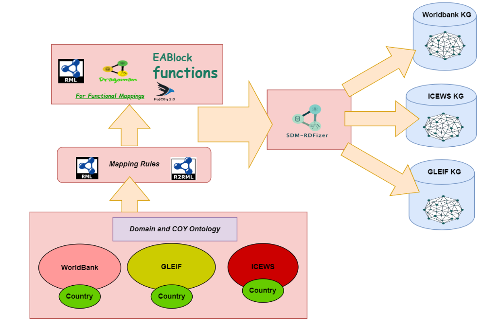
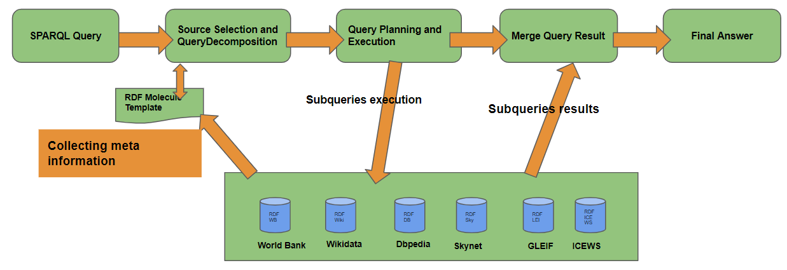
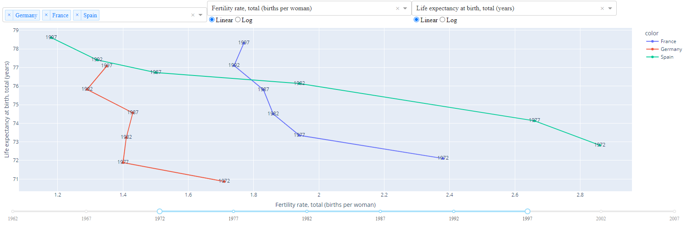
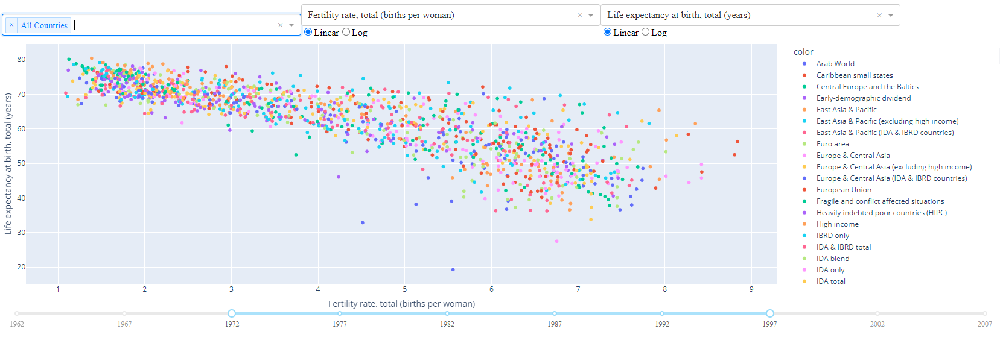

# Knowledge Graph Creation Pipeline and Federated Query Engine

```python
# Importing python packages to run demo - Third party packages
import pandas as pd
import plotly.express as px
import plotly.io as pio
pio.renderers.default = "browser"
import matplotlib.pyplot as plt
from io import StringIO
from IPython.display import display

# Adding path
from os.path import abspath
import sys
sys.path.insert(0, abspath('..'))

# 
from query_request import *
from query_def import *
from credentials import *
from functions import *
# from sqlalchemy import create_engine

# pandas display settings
pd.options.display.max_rows = 999
pd.options.display.max_columns = 999
pd.options.display.max_colwidth=None
```

# Knowledge Graph Creation Pipeline and Federated Query Engine

## Knowledge Graph Creation Pipeline

### Dataset

- [WorldBank](https://www.worldbank.org/en/home)
- [ICEWS](https://dataverse.harvard.edu/dataverse/icews) - Integrated Crisis Early Warning System
- [GLEIF](https://www.gleif.org/en) -  Global Legal Entity Identifier Foundation
- [Country Data](../data/country/countries_all_codes_and_wiki_dbp.csv)

### Ontology

- [Coy-Ontology](https://coypu-project.gitlab.io/coy-documentation/)
- [Others]()



## [Dragoman](https://github.com/SDM-TIB/Dragoman)

**An interpreter of functional mapping rules (defined in `RDF Mapping Language (RML)`) that interprets and transform the files into function-free mappings. These function mappings can be adopted by any RML-compliant Knowlege Graph creation engine (e.g. [SDM-RDFizer](https://github.com/SDM-TIB/SDM-RDFizer)).**

Step to follow for using Dragoman:

- [Install and Run Dragoman](https://github.com/SDM-TIB/Dragoman)
- Create functional [Mapping](https://fno.io/spec/) (e.g. [Local-Country](../../mappings/country/country_codes_func.ttl) mapping file)  and [Config](../../configs/config_func.ini)) (e.g [Local-Config](../../configs/config_func.ini) file) files
- Run [Dragoman](https://github.com/SDM-TIB/Dragoman) to convert functional mappings into function free mappings
- Run [SDM-Rdfizer]([[##SDM-RDFizer](https://github.com/SDM-TIB/Dragoman)](https://github.com/SDM-TIB/Dragoman)) to convert data into RDF Knowledge Graph using function-free mappings

## [SDM-RDFizer](https://github.com/SDM-TIB/SDM-RDFizer)

**An interpreter of mapping rules (defined in `RDF Mapping Language (RML)` ) that allows the transformation of (un)structured data into RDF knowledge graphs. It provides efficient RML triple map execution for Big data. SDM-RDFizer supports (`CSV, JSON, RDB, XML`).**

Step to create `Knowledge Graph` using SDM-Rdfizer:

- [Install and Run SDM-Rdfizer](https://github.com/SDM-TIB/SDM-RDFizer/wiki/Install&Run)
- Create [Mapping](https://rml.io/specs/rml/) (e.g. [Local-ICEWS](../../mappings/icews/icews.ttl) mapping file)  and [Config](https://github.com/SDM-TIB/SDM-RDFizer/wiki/The-Parameters-of-the-Configuration-file) (e.g [Local-Config](../../configs/config.ini) file) files
- Sematify data using `rdfizer.semantify`

### Example - How to semantify ICEWS dataset

```python
%%time
# Creating RDF data using config file
from rdfizer.semantify import semantify

semantify('../configs/config.ini')
```

    Semantifying icews...
    TM: https://mappings.coypu.org/icews#ICEWSEventMap
    Successfully semantified icews.
    
    
    Successfully semantified all datasets in 15.182 seconds.
    CPU times: user 14.7 s, sys: 544 ms, total: 15.2 s
    Wall time: 15.3 s

## [Creating Endpoint](../configs/docker_command_icews.sh)

`Example ICEWS Endpoint`

**Steps**

- Load data to remote server
- [Run Docker](../configs/docker_command_icews.sh) to create endpoint on TIB server(if you have permission)
- [Endpoint](https://labs.tib.eu/sdm/icews_endpoint/sparql)

## Federated Query Engine - [Detrusty](https://github.com/SDM-TIB/DeTrusty)

- Integrates a federation of remote RDF knowledge graphs (heterogeneous data)
- Unified interface to query a federation using SPARQL 1.1 protocol without service operation
- List of RDF KGs : Public KG ([WorldBank](https://labs.tib.eu/sdm/worldbank_endpoint/sparql/), [Wikidata](https://query.wikidata.org/), [DBpedia](https://dbpedia.org/sparql), [ICEWS](https://labs.tib.eu/sdm/icews_endpoint/sparql), [GLEIF](https://labs.tib.eu/sdm/lei_endpoint/sparql),
[Skynet (Private KG)](https://skynet.coypu.org))
- [How to run and configure it](https://github.com/SDM-TIB/DeTrusty)
- [Detrusty Endpoint](https://labs.tib.eu/sdm/detrusty_coypu/sparql) to execute queries
- [Detrusty Query Planner](https://labs.tib.eu/sdm/detrusty_coypu/query_plan)



```python
# Checking status of endpoints

# Demo query to all available enpoints

# demo query
query_test = """
             SELECT * WHERE{ ?Subject a ?Concept }LIMIT 1000
             """


# creating query request for cmemc
display("############### Cmemc Endpoint ###############")
cmemc_request = SPARQLRequest(client_url_imp, client_id_imp, client_secret_imp , 'oauth')
# executing query and printing response
cmemc_request.execute(query_test)
buf = StringIO(cmemc_request.response.content.decode('utf-8'), newline='\r\n')          
display(pd.read_csv(buf, encoding='utf-8').tail(5))

# creating query request for skynet
display("############### Skynet Endpoint ###############")
skynet_request = SPARQLRequest(skynet_endpoint, skynet_user, skynet_pass, 'basic')
# executing query and printing response
skynet_request.execute(query_test)
buf = StringIO(skynet_request.response.content.decode('utf-8'), newline='\r\n')          
display(pd.read_csv(buf, encoding='utf-8').tail(5))

# creating query request for worldbank
display("############### Worldbank Endpoint ###############")
worldbank_request = SPARQLRequest(worldbank_endpoint)
# executing query and printing response
worldbank_request.execute(query_test)
display(worldbank_request.response.status_code)
buf = StringIO(worldbank_request.response.content.decode('utf-8'), newline='\r\n')          
display(pd.read_csv(buf, encoding='utf-8').tail(5))

# creating query request for LEI
"""display("############### LEI Endpoint ###############")
lei_request = SPARQLRequest(lei_endpoint)
# executing query and printing response
lei_request.execute(query_test)
buf = StringIO(lei_request.response.content.decode('utf-8'), newline='\r\n')          
display(pd.read_csv(buf, encoding='utf-8').tail(5))"""

# creating query request for ICEWS
display("############### ICEWS Endpoint ###############")
icews_request = SPARQLRequest(icews_endpoint)
# executing query and printing response
icews_request.execute(query_test)
buf = StringIO(icews_request.response.content.decode('utf-8'), newline='\r\n')          
display(pd.read_csv(buf, encoding='utf-8').tail(5))


# creating query request for Detrusty
display("############### Detrusty Endpoint ###############")
detrusty_request = SPARQLRequest(detrusty_endpoint, detrusty_user, detrusty_pass, 'basic', is_fdq=True)
# executing query and printing response
detrusty_request.execute(query_test)
# print(detrusty_request.response.json()['results']['bindings'])
# buf = StringIO(detrusty_request.response.content.decode('utf-8'), newline='\r\n')          
display(pd.json_normalize(detrusty_request.response.json()['results']['bindings']).tail(5))

```

    '############### Cmemc Endpoint ###############'


    Non-FDQ
    auth_type
    Passed Query Status: 200
    Total time taken by execute function: 0.40398335456848145

<div>
<style scoped>
    .dataframe tbody tr th:only-of-type {
        vertical-align: middle;
    }

    .dataframe tbody tr th {
        vertical-align: top;
    }

    .dataframe thead th {
        text-align: right;
    }
</style>
<table border="1" class="dataframe">
  <thead>
    <tr style="text-align: right;">
      <th></th>
      <th>Subject</th>
      <th>Concept</th>
    </tr>
  </thead>
  <tbody>
    <tr>
      <th>995</th>
      <td>https://vocab.eccenca.com/shacl/GraphTemplateJinjaTemplatePropertyShape</td>
      <td>http://www.w3.org/2000/01/rdf-schema#Resource</td>
    </tr>
    <tr>
      <th>996</th>
      <td>https://vocab.eccenca.com/shacl/GraphTemplateJinjaTemplatePropertyShape</td>
      <td>http://www.w3.org/ns/shacl#PropertyShape</td>
    </tr>
    <tr>
      <th>997</th>
      <td>https://vocab.eccenca.com/shui/jinjaTemplateString</td>
      <td>http://www.w3.org/1999/02/22-rdf-syntax-ns#Property</td>
    </tr>
    <tr>
      <th>998</th>
      <td>https://vocab.eccenca.com/shui/jinjaTemplateString</td>
      <td>http://www.w3.org/2000/01/rdf-schema#Resource</td>
    </tr>
    <tr>
      <th>999</th>
      <td>https://vocab.eccenca.com/shui/jinjaTemplateString</td>
      <td>http://www.w3.org/2002/07/owl#DatatypeProperty</td>
    </tr>
  </tbody>
</table>
</div>

    '############### Skynet Endpoint ###############'


    Non-FDQ
    auth_type
    Passed Query Status: 200
    Total time taken by execute function: 0.0829010009765625

<div>
<style scoped>
    .dataframe tbody tr th:only-of-type {
        vertical-align: middle;
    }

    .dataframe tbody tr th {
        vertical-align: top;
    }

    .dataframe thead th {
        text-align: right;
    }
</style>
<table border="1" class="dataframe">
  <thead>
    <tr style="text-align: right;">
      <th></th>
      <th>Subject</th>
      <th>Concept</th>
    </tr>
  </thead>
  <tbody>
    <tr>
      <th>995</th>
      <td>https://data.coypu.org/industry/exiobase/regional/Mining_of_lead_zinc_and_tin_ores_and_concentrates_WF</td>
      <td>https://schema.coypu.org/global#RegionalIndustry</td>
    </tr>
    <tr>
      <th>996</th>
      <td>https://data.coypu.org/industry/exiobase/regional/Cultivation_of_oil_seeds_CY</td>
      <td>https://schema.coypu.org/global#RegionalIndustry</td>
    </tr>
    <tr>
      <th>997</th>
      <td>https://data.coypu.org/industry/exiobase/regional/Processing_of_Food_products_nec_BG</td>
      <td>https://schema.coypu.org/global#RegionalIndustry</td>
    </tr>
    <tr>
      <th>998</th>
      <td>https://data.coypu.org/industry/exiobase/regional/Extraction_of_natural_gas_and_services_related_to_natural_gas_extraction_excluding_surveying_LU</td>
      <td>https://schema.coypu.org/global#RegionalIndustry</td>
    </tr>
    <tr>
      <th>999</th>
      <td>https://data.coypu.org/industry/exiobase/regional/Cultivation_of_cereal_grains_nec_LV</td>
      <td>https://schema.coypu.org/global#RegionalIndustry</td>
    </tr>
  </tbody>
</table>
</div>

    '############### Worldbank Endpoint ###############'


    Non-FDQ
    Passed Query Status: 200
    Total time taken by execute function: 0.07476019859313965


    200

<div>
<style scoped>
    .dataframe tbody tr th:only-of-type {
        vertical-align: middle;
    }

    .dataframe tbody tr th {
        vertical-align: top;
    }

    .dataframe thead th {
        text-align: right;
    }
</style>
<table border="1" class="dataframe">
  <thead>
    <tr style="text-align: right;">
      <th></th>
      <th>Subject</th>
      <th>Concept</th>
    </tr>
  </thead>
  <tbody>
    <tr>
      <th>995</th>
      <td>http://worldbank.org/Indicator/IC.FRM.BKWC.ZS</td>
      <td>http://worldbank.org/Indicator</td>
    </tr>
    <tr>
      <th>996</th>
      <td>http://worldbank.org/Indicator/IC.FRM.BNKS.ZS</td>
      <td>http://worldbank.org/Indicator</td>
    </tr>
    <tr>
      <th>997</th>
      <td>http://worldbank.org/Indicator/IC.FRM.BRIB.ZS</td>
      <td>http://worldbank.org/Indicator</td>
    </tr>
    <tr>
      <th>998</th>
      <td>http://worldbank.org/Indicator/IC.FRM.CMPU.ZS</td>
      <td>http://worldbank.org/Indicator</td>
    </tr>
    <tr>
      <th>999</th>
      <td>http://worldbank.org/Indicator/IC.FRM.CORR.ZS</td>
      <td>http://worldbank.org/Indicator</td>
    </tr>
  </tbody>
</table>
</div>

    '############### ICEWS Endpoint ###############'


    Non-FDQ
    Passed Query Status: 200
    Total time taken by execute function: 0.06499743461608887

<div>
<style scoped>
    .dataframe tbody tr th:only-of-type {
        vertical-align: middle;
    }

    .dataframe tbody tr th {
        vertical-align: top;
    }

    .dataframe thead th {
        text-align: right;
    }
</style>
<table border="1" class="dataframe">
  <thead>
    <tr style="text-align: right;">
      <th></th>
      <th>Subject</th>
      <th>Concept</th>
    </tr>
  </thead>
  <tbody>
    <tr>
      <th>995</th>
      <td>https://data.coypu.org/icews/36616020</td>
      <td>https://schema.coypu.org/global#SocioPoliticalEvent</td>
    </tr>
    <tr>
      <th>996</th>
      <td>https://data.coypu.org/icews/36616021</td>
      <td>https://schema.coypu.org/global#SocioPoliticalEvent</td>
    </tr>
    <tr>
      <th>997</th>
      <td>https://data.coypu.org/icews/36616024</td>
      <td>https://schema.coypu.org/global#SocioPoliticalEvent</td>
    </tr>
    <tr>
      <th>998</th>
      <td>https://data.coypu.org/icews/36616025</td>
      <td>https://schema.coypu.org/global#SocioPoliticalEvent</td>
    </tr>
    <tr>
      <th>999</th>
      <td>https://data.coypu.org/icews/36616026</td>
      <td>https://schema.coypu.org/global#SocioPoliticalEvent</td>
    </tr>
  </tbody>
</table>
</div>

    '############### Detrusty Endpoint ###############'


    auth_type and is_fdq
    Passed Query Status: 200
    Total time taken by execute function: 0.8539445400238037

<div>
<style scoped>
    .dataframe tbody tr th:only-of-type {
        vertical-align: middle;
    }

    .dataframe tbody tr th {
        vertical-align: top;
    }

    .dataframe thead th {
        text-align: right;
    }
</style>
<table border="1" class="dataframe">
  <thead>
    <tr style="text-align: right;">
      <th></th>
      <th>Concept.type</th>
      <th>Concept.value</th>
      <th>Subject.type</th>
      <th>Subject.value</th>
      <th>__meta__.is_verified</th>
    </tr>
  </thead>
  <tbody>
    <tr>
      <th>995</th>
      <td>uri</td>
      <td>https://www.omg.org/spec/LCC/Countries/CountryRepresentation/Country</td>
      <td>uri</td>
      <td>https://www.omg.org/spec/LCC/Countries/ISO3166-1-CountryCodes-Adjunct/PE</td>
      <td>True</td>
    </tr>
    <tr>
      <th>996</th>
      <td>uri</td>
      <td>http://www.openlinksw.com/schemas/virtrdf#QuadMapFormat</td>
      <td>uri</td>
      <td>http://www.openlinksw.com/virtrdf-data-formats#sql-time-literal-fn-nullable</td>
      <td>True</td>
    </tr>
    <tr>
      <th>997</th>
      <td>uri</td>
      <td>https://www.omg.org/spec/LCC/Countries/CountryRepresentation/Country</td>
      <td>uri</td>
      <td>https://www.omg.org/spec/LCC/Countries/ISO3166-1-CountryCodes-Adjunct/PF</td>
      <td>True</td>
    </tr>
    <tr>
      <th>998</th>
      <td>uri</td>
      <td>https://schema.coypu.org/global#RegionalIndustry</td>
      <td>uri</td>
      <td>https://data.coypu.org/industry/exiobase/regional/Renting_of_machinery_and_equipment_without_operator_and_of_personal_and_household_goods_BR</td>
      <td>True</td>
    </tr>
    <tr>
      <th>999</th>
      <td>uri</td>
      <td>https://www.omg.org/spec/LCC/Countries/CountryRepresentation/Country</td>
      <td>uri</td>
      <td>https://www.omg.org/spec/LCC/Countries/ISO3166-1-CountryCodes-Adjunct/PG</td>
      <td>True</td>
    </tr>
  </tbody>
</table>
</div>

### Examples

#### Federated Query Example 1 - [GDP Per Capita Vs Carbon Emission Per Capita in Germany](https://dashboards.coypu.org/queries/240#540)

```sparql
PREFIX wb: <http://worldbank.org/>
PREFIX wbi: <http://worldbank.org/Indicator/>
PREFIX dc: <http://purl.org/dc/elements/1.1/>
PREFIX dcterms: <http://purl.org/dc/terms/>
PREFIX dbo: <http://dbpedia.org/ontology/>
PREFIX geo: <https://www.geonames.org/ontology#>
PREFIX time: <http://www.w3.org/2006/time#>

PREFIX wd: <http://www.wikidata.org/entity/>
PREFIX wds: <http://www.wikidata.org/entity/statement/>
PREFIX wdv: <http://www.wikidata.org/value/>
PREFIX wdt: <http://www.wikidata.org/prop/direct/>
PREFIX wikibase: <http://wikiba.se/ontology#>
PREFIX p: <http://www.wikidata.org/prop/>
PREFIX ps: <http://www.wikidata.org/prop/statement/>
PREFIX pq: <http://www.wikidata.org/prop/qualifier/>
PREFIX bd: <http://www.bigdata.com/rdf#>
PREFIX owl: <http://www.w3.org/2002/07/owl#>
PREFIX rdfs: <http://www.w3.org/2000/01/rdf-schema#>


SELECT ?year (Avg(?value/?population) as ?gdp_per_capita) (Avg(?value1/?population)*1000000 as ?carbon_per_capita)
WHERE {
  
    ?indicator a wb:AnnualIndicatorEntry .
    ?indicator wb:hasIndicator <http://worldbank.org/Indicator/NY.GDP.MKTP.CD> .
    ?indicator wb:hasCountry ?country .
    ?indicator owl:hasValue ?value .
    ?indicator time:year ?year .
    ?country <http://purl.org/dc/elements/1.1/identifier> 'DEU' .
    ?country rdfs:label ?country_name.
    
    ?indicator1 a wb:AnnualIndicatorEntry .
    ?indicator1 wb:hasIndicator <http://worldbank.org/Indicator/EN.ATM.CO2E.KT> .
    ?indicator1 wb:hasCountry ?country1 .
    ?indicator1 owl:hasValue ?value1 .
    ?indicator1 time:year ?year .
    ?country1 <http://purl.org/dc/elements/1.1/identifier> 'DEU' .
    ?country1 rdfs:label ?country_name1.
    
    
    ?countryWiki p:P298 ?isoCode .
    ?isoCode ps:P298 'DEU' .
    ?countryWiki p:P1082 ?itemP .
    ?itemP pq:P585 ?time.
    ?itemP ps:P1082 ?population .
    BIND(year(?time) AS ?year)}
Group By ?year
ORDER BY ?year
```

#### Federated Query Example 2 - [Fatalities in Ukraine](https://dashboards.coypu.org/queries/241#541)

```sparql
PREFIX coy: <https://schema.coypu.org/global#>
PREFIX rdfs: <http://www.w3.org/2000/01/rdf-schema#>
PREFIX xsd: <http://www.w3.org/2001/XMLSchema#>
PREFIX owl: <http://www.w3.org/2002/07/owl#>
PREFIX skos: <http://www.w3.org/2004/02/skos/core#>
PREFIX time: <http://www.w3.org/2006/time#>

PREFIX wd: <http://www.wikidata.org/entity/>
PREFIX wds: <http://www.wikidata.org/entity/statement/>
PREFIX wdv: <http://www.wikidata.org/value/>
PREFIX wdt: <http://www.wikidata.org/prop/direct/>
PREFIX wikibase: <http://wikiba.se/ontology#>
PREFIX p: <http://www.wikidata.org/prop/>
PREFIX ps: <http://www.wikidata.org/prop/statement/>
PREFIX pq: <http://www.wikidata.org/prop/qualifier/>
PREFIX bd: <http://www.bigdata.com/rdf#>

SELECT ?year (COUNT(?iri) AS ?no_of_events)  ((sum(?fatalities)/avg(?population))*1000000 as ?per_fatalities_per_million)
WHERE {
    ?iri a coy:Conflict .
    ?iri coy:hasCountryLocation ?code_uri .
    ?code_uri coy:hasIsoCode 'UKR' .
    ?iri coy:hasTimestamp ?timestamp .
    ?iri coy:hasFatalities ?fatalities .
    BIND(year(?timestamp) as ?year)
    
    ?countryWiki p:P298 ?isoCode .
    ?isoCode ps:P298 'UKR' .
    ?countryWiki p:P1082 ?itemP .
    ?itemP pq:P585 ?time .
    ?itemP ps:P1082 ?population .
    BIND(year(?time) as ?year)}
Group by ?year
```

#### Federated Query Example 3 - [Carbon Emission Vs Disaster Event in Germany](https://dashboards.coypu.org/queries/238#538)

```sparql
PREFIX co: <http://purl.org/ontology/co/core#>
PREFIX ti: <http://www.ontologydesignpatterns.org/cp/owl/timeinterval.owl#>
PREFIX coy: <https://schema.coypu.org/global#>
PREFIX rdfs: <http://www.w3.org/2000/01/rdf-schema#>
PREFIX xsd: <http://www.w3.org/2001/XMLSchema#>
PREFIX owl: <http://www.w3.org/2002/07/owl#>
PREFIX skos: <http://www.w3.org/2004/02/skos/core#>
PREFIX time: <http://www.w3.org/2006/time#>

PREFIX wb: <http://worldbank.org/>
PREFIX wbi: <http://worldbank.org/Indicator/>
PREFIX dc: <http://purl.org/dc/elements/1.1/>
PREFIX dcterms: <http://purl.org/dc/terms/>
PREFIX dbo: <http://dbpedia.org/ontology/>
PREFIX geo: <https://www.geonames.org/ontology#>
PREFIX owl: <http://www.w3.org/2002/07/owl#>
PREFIX time: <http://www.w3.org/2006/time#>
PREFIX rdfs: <http://www.w3.org/2000/01/rdf-schema#>

SELECT ?year (AVG(?value) as ?carbon_emission) (COUNT(?disaster) as ?no_of_disasters)
WHERE {
   
    ?indicator a wb:AnnualIndicatorEntry .
    ?indicator wb:hasIndicator <http://worldbank.org/Indicator/EN.ATM.CO2E.KT> .
    ?indicator wb:hasCountry ?country .
    ?indicator owl:hasValue ?value .
    ?indicator time:year ?year .
    ?country   dc:identifier 'DEU' .
  
    ?disaster a coy:Disaster .
    ?disaster coy:hasYear ?year .
    ?disaster coy:hasCountryLocation ?country_code_uri .
    ?country_code_uri coy:hasIsoCode 'DEU'.}
GROUP BY ?year
ORDER BY ?year
```

#### Federated Query Example 4 - [Average Life Expectancy(WorldBank Vs Wikidata) in year 2017 for different countries](https://dashboards.coypu.org/queries/239#539)

```Sparql
PREFIX wb: <http://worldbank.org/>
PREFIX wbi: <http://worldbank.org/Indicator/>
PREFIX owl: <http://www.w3.org/2002/07/owl#>
PREFIX time: <http://www.w3.org/2006/time#>
PREFIX wd: <http://www.wikidata.org/entity/>
PREFIX p: <http://www.wikidata.org/prop/>
PREFIX ps: <http://www.wikidata.org/prop/statement/>
PREFIX pq: <http://www.wikidata.org/prop/qualifier/>
PREFIX dc: <http://purl.org/dc/elements/1.1/>
PREFIX dcterms: <http://purl.org/dc/terms/>
PREFIX rdfs: <http://www.w3.org/2000/01/rdf-schema#>

SELECT DISTINCT ?country_code ?country_name ?year (avg(?year_exp_WB) as ?exp_wb) (avg(?year_exp) as ?exp_wiki)
WHERE {
    ?country a wb:Country .
    ?country dc:identifier ?country_code .
    ?country rdfs:label ?country_name.
    ?country owl:sameAs ?sameAsCountry .
    ?country wb:hasAnnualIndicatorEntry ?annualIndicator .
    ?annualIndicator wb:hasIndicator <http://worldbank.org/Indicator/SP.DYN.LE00.IN> .
    ?annualIndicator owl:hasValue ?year_exp_WB .
    ?annualIndicator time:year ?year .
  
    ?sameAsCountry p:P2250 ?itemLifeExpectancy .
    ?itemLifeExpectancy ps:P2250 ?year_exp .
    ?itemLifeExpectancy pq:P585 ?time .
    BIND(year(?time) AS ?year)
    Filter(?year=2017)}
GROUP BY ?country_code ?country_name ?year
ORDER BY ?country_code
```

#### Federated Query Example 5 - [Population for different countries and their capital 2021 ](https://dashboards.coypu.org/queries/247/source#569)

```Sparql
PREFIX wb: <http://worldbank.org/>
PREFIX wbi: <http://worldbank.org/Indicator/>
PREFIX dc: <http://purl.org/dc/elements/1.1/>
PREFIX dcterms: <http://purl.org/dc/terms/>
PREFIX dbo: <http://dbpedia.org/ontology/>
PREFIX geo: <https://www.geonames.org/ontology#>
PREFIX owl: <http://www.w3.org/2002/07/owl#>
PREFIX time: <http://www.w3.org/2006/time#>
PREFIX rdfs: <http://www.w3.org/2000/01/rdf-schema#>
PREFIX wd: <http://www.wikidata.org/entity/>
PREFIX wds: <http://www.wikidata.org/entity/statement/>
PREFIX wdv: <http://www.wikidata.org/value/>
PREFIX wdt: <http://www.wikidata.org/prop/direct/>
PREFIX wikibase: <http://wikiba.se/ontology#>
PREFIX p: <http://www.wikidata.org/prop/>
PREFIX ps: <http://www.wikidata.org/prop/statement/>
PREFIX pq: <http://www.wikidata.org/prop/qualifier/>
PREFIX bd: <http://www.bigdata.com/rdf#>


SELECT distinct ?code ?country_name ?value ?capital ?population ?gps ?year
WHERE {
    
    ?indicator a wb:AnnualIndicatorEntry .
    ?indicator wb:hasIndicator <http://worldbank.org/Indicator/SP.POP.TOTL> .
    ?indicator wb:hasCountry ?country .
    ?indicator owl:hasValue ?value .
    ?indicator time:year ?year .
    ?country <http://purl.org/dc/elements/1.1/identifier> ?code .
    ?country rdfs:label ?country_name.
    filter(?year=2021)
  
    ?countryWiki p:P298 ?isoCode .
    ?isoCode ps:P298 ?code .
    ?countryWiki wdt:P36 ?capital .
    ?capital p:P1082 ?population_iri .
    ?population_iri pq:P585 ?time .
    ?population_iri ps:P1082 ?population .
    ?capital wdt:P625 ?gps .
    BIND(year(?time) as ?year)
}Order by ?code
```

#### Federated Query Example 6 - [Population and Net Migration for United Kingdom](https://dashboards.coypu.org/queries/248/source#560)

```Sparql
PREFIX wd: <http://www.wikidata.org/entity/>
PREFIX wds: <http://www.wikidata.org/entity/statement/>
PREFIX wdv: <http://www.wikidata.org/value/>
PREFIX wdt: <http://www.wikidata.org/prop/direct/>
PREFIX wikibase: <http://wikiba.se/ontology#>
PREFIX p: <http://www.wikidata.org/prop/>
PREFIX ps: <http://www.wikidata.org/prop/statement/>
PREFIX pq: <http://www.wikidata.org/prop/qualifier/>
PREFIX bd: <http://www.bigdata.com/rdf#>

PREFIX wb: <http://worldbank.org/>
PREFIX wbi: <http://worldbank.org/Indicator/>
PREFIX dc: <http://purl.org/dc/elements/1.1/>
PREFIX dcterms: <http://purl.org/dc/terms/>
PREFIX dbo: <http://dbpedia.org/ontology/>
PREFIX geo: <https://www.geonames.org/ontology#>
PREFIX owl: <http://www.w3.org/2002/07/owl#>
PREFIX time: <http://www.w3.org/2006/time#>
PREFIX rdfs: <http://www.w3.org/2000/01/rdf-schema#>

select ?year (avg(?population1) as ?population) (avg(?net_migration1) as ?net_migration)
where {
  
    ?indicator a wb:AnnualIndicatorEntry .
    ?indicator wb:hasIndicator <http://worldbank.org/Indicator/SM.POP.NETM> .
    ?indicator wb:hasCountry ?country .
    ?indicator owl:hasValue ?net_migration1 .
    ?indicator time:year ?year .
    ?country <http://purl.org/dc/elements/1.1/identifier> 'GBR' .
    ?country rdfs:label ?country_name.
  
    ?countryWiki p:P298 ?isoCode .
    ?isoCode ps:P298 'GBR' .
    ?countryWiki p:P1082 ?itemP .
    ?itemP pq:P585 ?time .
    ?itemP ps:P1082 ?population1 .
    BIND(year(?time) as ?year)  
  
}Group by ?year
Order by ?year
```

#### Federated Query Example 7 - [GDP Growth in different years under different President of United States]()

```Sparql
PREFIX wd: <http://www.wikidata.org/entity/>
PREFIX wds: <http://www.wikidata.org/entity/statement/>
PREFIX wdv: <http://www.wikidata.org/value/>
PREFIX wdt: <http://www.wikidata.org/prop/direct/>
PREFIX wikibase: <http://wikiba.se/ontology#>
PREFIX p: <http://www.wikidata.org/prop/>
PREFIX ps: <http://www.wikidata.org/prop/statement/>
PREFIX pq: <http://www.wikidata.org/prop/qualifier/>
PREFIX bd: <http://www.bigdata.com/rdf#>

PREFIX wb: <http://worldbank.org/>
PREFIX wbi: <http://worldbank.org/Indicator/>
PREFIX dc: <http://purl.org/dc/elements/1.1/>
PREFIX dcterms: <http://purl.org/dc/terms/>
PREFIX dbo: <http://dbpedia.org/ontology/>
PREFIX geo: <https://www.geonames.org/ontology#>
PREFIX owl: <http://www.w3.org/2002/07/owl#>
PREFIX time: <http://www.w3.org/2006/time#>
PREFIX rdfs: <http://www.w3.org/2000/01/rdf-schema#>

select ?value ?year ?president ?syear ?eyear 
where {

    
    service <https://labs.tib.eu/sdm/worldbank_endpoint/sparql>{
    ?indicator a wb:AnnualIndicatorEntry .
    ?indicator wb:hasIndicator <http://worldbank.org/Indicator/NY.GDP.MKTP.KD.ZG> .
    ?indicator wb:hasCountry ?country .
    ?indicator owl:hasValue ?value .
    ?indicator time:year ?year .
    ?country <http://purl.org/dc/elements/1.1/identifier> 'USA' .
    ?country rdfs:label ?country_name.}
  
        
    service <https://query.wikidata.org/sparql>{
    ?countryWiki p:P298 ?isoCode .
    ?isoCode ps:P298 'USA' .
    ?countryWiki p:P6 ?itemP .
    ?itemP ps:P6 ?president.
    ?itemP pq:P580 ?start_time.
    ?itemP pq:P582 ?end_time.
    Bind(year(?start_time) as ?syear)
    Bind(year(?end_time) as ?eyear)
    }
  filter(?year>=?syear && ?year<=?eyear)
}
```

#### Federated Query Example 8 - [Avg GDP Growth under different President of United States](https://dashboards.coypu.org/queries/249/source#564)

```Sparql
PREFIX wd: <http://www.wikidata.org/entity/>
PREFIX wds: <http://www.wikidata.org/entity/statement/>
PREFIX wdv: <http://www.wikidata.org/value/>
PREFIX wdt: <http://www.wikidata.org/prop/direct/>
PREFIX wikibase: <http://wikiba.se/ontology#>
PREFIX p: <http://www.wikidata.org/prop/>
PREFIX ps: <http://www.wikidata.org/prop/statement/>
PREFIX pq: <http://www.wikidata.org/prop/qualifier/>
PREFIX bd: <http://www.bigdata.com/rdf#>

PREFIX wb: <http://worldbank.org/>
PREFIX wbi: <http://worldbank.org/Indicator/>
PREFIX dc: <http://purl.org/dc/elements/1.1/>
PREFIX dcterms: <http://purl.org/dc/terms/>
PREFIX dbo: <http://dbpedia.org/ontology/>
PREFIX geo: <https://www.geonames.org/ontology#>
PREFIX owl: <http://www.w3.org/2002/07/owl#>
PREFIX time: <http://www.w3.org/2006/time#>
PREFIX rdfs: <http://www.w3.org/2000/01/rdf-schema#>

select ?president ?syear ?eyear(avg(?value) as ?avg_gdp_growth) 
where {

    
   service <https://labs.tib.eu/sdm/worldbank_endpoint/sparql>{
    ?indicator a wb:AnnualIndicatorEntry .
    ?indicator wb:hasIndicator <http://worldbank.org/Indicator/NY.GDP.MKTP.KD.ZG> .
    ?indicator wb:hasCountry ?country .
    ?indicator owl:hasValue ?value .
    ?indicator time:year ?year .
    ?country <http://purl.org/dc/elements/1.1/identifier> 'USA' .
    ?country rdfs:label ?country_name.}
  
        
    service <https://query.wikidata.org/sparql>{
    ?countryWiki p:P298 ?isoCode .
    ?isoCode ps:P298 'USA' .
    ?countryWiki p:P6 ?itemP .
    ?itemP ps:P6 ?president.
    ?itemP pq:P580 ?start_time.
    ?itemP pq:P582 ?end_time.
    Bind(year(?start_time) as ?syear)
    Bind(year(?end_time) as ?eyear)
    }
  filter(?year>=?syear && ?year<=?eyear)
} Group by ?president ?syear ?eyear
```

#### Federated Query Example 9 - [Population Growth and Fertility Rate in United States](https://dashboards.coypu.org/queries/250/source#568)

```Sparql
PREFIX wd: <http://www.wikidata.org/entity/>
PREFIX wds: <http://www.wikidata.org/entity/statement/>
PREFIX wdv: <http://www.wikidata.org/value/>
PREFIX wdt: <http://www.wikidata.org/prop/direct/>
PREFIX wikibase: <http://wikiba.se/ontology#>
PREFIX p: <http://www.wikidata.org/prop/>
PREFIX ps: <http://www.wikidata.org/prop/statement/>
PREFIX pq: <http://www.wikidata.org/prop/qualifier/>
PREFIX bd: <http://www.bigdata.com/rdf#>

PREFIX wb: <http://worldbank.org/>
PREFIX wbi: <http://worldbank.org/Indicator/>
PREFIX dc: <http://purl.org/dc/elements/1.1/>
PREFIX dcterms: <http://purl.org/dc/terms/>
PREFIX dbo: <http://dbpedia.org/ontology/>
PREFIX geo: <https://www.geonames.org/ontology#>
PREFIX owl: <http://www.w3.org/2002/07/owl#>
PREFIX time: <http://www.w3.org/2006/time#>
PREFIX rdfs: <http://www.w3.org/2000/01/rdf-schema#>

select ?year ?population_growth ?fertility_rate
where {
    service <https://labs.tib.eu/sdm/worldbank_endpoint/sparql>{
    ?indicator a wb:AnnualIndicatorEntry .
    ?indicator wb:hasIndicator <http://worldbank.org/Indicator/SP.POP.GROW> .
    ?indicator wb:hasCountry ?country .
    ?indicator owl:hasValue ?population_growth .
    ?indicator time:year ?year .
    ?country <http://purl.org/dc/elements/1.1/identifier> 'USA' .
    ?country rdfs:label ?country_name.}
    
    service <https://query.wikidata.org/sparql>{
    ?countryWiki p:P298 ?isoCode .
    ?isoCode ps:P298 'USA' .
    ?countryWiki p:P4841 ?itemP .
    ?itemP ps:P4841 ?fertility_rate.
    ?itemP pq:P585 ?time.
    Bind(year(?time) as ?year)}
} 
```

#### Federated Query Example 10 - [Human Development Index vs Human Capital Index in Germany](https://dashboards.coypu.org/queries/251/source#572)

```Sparql
PREFIX wd: <http://www.wikidata.org/entity/>
PREFIX wds: <http://www.wikidata.org/entity/statement/>
PREFIX wdv: <http://www.wikidata.org/value/>
PREFIX wdt: <http://www.wikidata.org/prop/direct/>
PREFIX wikibase: <http://wikiba.se/ontology#>
PREFIX p: <http://www.wikidata.org/prop/>
PREFIX ps: <http://www.wikidata.org/prop/statement/>
PREFIX pq: <http://www.wikidata.org/prop/qualifier/>
PREFIX bd: <http://www.bigdata.com/rdf#>

PREFIX wb: <http://worldbank.org/>
PREFIX wbi: <http://worldbank.org/Indicator/>
PREFIX dc: <http://purl.org/dc/elements/1.1/>
PREFIX dcterms: <http://purl.org/dc/terms/>
PREFIX dbo: <http://dbpedia.org/ontology/>
PREFIX geo: <https://www.geonames.org/ontology#>
PREFIX owl: <http://www.w3.org/2002/07/owl#>
PREFIX time: <http://www.w3.org/2006/time#>
PREFIX rdfs: <http://www.w3.org/2000/01/rdf-schema#>

select ?year ?hci ?hdi
where {
    service <https://labs.tib.eu/sdm/worldbank_endpoint/sparql>{
    ?indicator a wb:AnnualIndicatorEntry .
    ?indicator wb:hasIndicator <http://worldbank.org/Indicator/HD.HCI.OVRL> .
    ?indicator wb:hasCountry ?country .
    Optional {?indicator owl:hasValue ?hci .}
    ?indicator time:year ?year .
    ?country <http://purl.org/dc/elements/1.1/identifier> 'DEU' .
    ?country rdfs:label ?country_name.}
    
    
    service <https://query.wikidata.org/sparql>{
    ?countryWiki p:P298 ?isoCode .
    ?isoCode ps:P298 'DEU' .
    ?countryWiki p:P1081 ?hdi_iri .
    ?hdi_iri ps:P1081 ?hdi.
    ?hdi_iri pq:P585 ?time.
    Bind(year(?time) as ?year)}
} 
```

## [WorldBank Dashboard]( http://127.0.0.1:8896)





```python
from dash import Dash, dcc, html, Input, Output
import plotly.express as px
from jupyter_dash import JupyterDash
import numpy as np
import pandas as pd

df = pd.read_csv('../query_results/country_indicators.csv')
app = JupyterDash(__name__)
app = worldbank_layout(df, app)


@app.callback(
    Output('indicator-graphic', 'figure'),
    Input('country-name', 'value'),
    Input('xaxis-column', 'value'),
    Input('yaxis-column', 'value'),
    Input('xaxis-type', 'value'),
    Input('yaxis-type', 'value'),
    Input('year-range-slider', 'value'))
def update_graph(country_name, xaxis_column_name, yaxis_column_name,
                 xaxis_type, yaxis_type, year_value):
    
    # print (country_name, xaxis_column_name, yaxis_column_name,
    #             xaxis_type, yaxis_type, year_value)
    
    
    if  'All Countries' in country_name :
        dff = df[(df['Year'] >= year_value[0]) & (df['Year'] <= year_value[1])]
        dff.set_index('Year', inplace=True, drop=False)

        fig = px.scatter(x=dff[dff['Indicator Name'] == xaxis_column_name]['Value'],
                         y=dff[dff['Indicator Name'] == yaxis_column_name]['Value'],
                         hover_name=dff[dff['Indicator Name'] == yaxis_column_name]['Country Name']+'_'\
                         +dff[dff['Indicator Name'] == yaxis_column_name]['Year'].apply(str),
                         #hover_data=dff[dff['Indicator Name'] == yaxis_column_name]['Year'],
                         color=dff[dff['Indicator Name'] == yaxis_column_name]['Country Name']
                        )
        
        print('If Executed')

        fig.update_layout(margin={'l': 40, 'b': 40, 't': 10, 'r': 0}, hovermode='closest')

        fig.update_xaxes(title=xaxis_column_name,
                         type='linear' if xaxis_type == 'Linear' else 'log')

        fig.update_yaxes(title=yaxis_column_name,
                         type='linear' if yaxis_type == 'Linear' else 'log')
    else:
        dff = df[(df['Country Name'].isin(country_name)) &\
                 (df['Year'] >= year_value[0]) & (df['Year'] <= year_value[1])]
        
        dff.set_index('Year', inplace=True, drop=False)

        """fig = px.scatter(x=dff[dff['Indicator Name'] == xaxis_column_name]['Value'],
                         y=dff[dff['Indicator Name'] == yaxis_column_name]['Value'],
                         hover_name=dff[dff['Indicator Name'] == yaxis_column_name]['Year'])"""
        
        fig = px.line(x=dff[dff['Indicator Name'] == xaxis_column_name]['Value'],\
                y=dff[dff['Indicator Name'] == yaxis_column_name]['Value'],\
                text = dff[dff['Indicator Name'] == yaxis_column_name]['Year'],\
                color=dff[dff['Indicator Name'] == yaxis_column_name]['Country Name'])
        
        print('Else Executed')

        fig.update_layout(margin={'l': 40, 'b': 40, 't': 10, 'r': 0}, hovermode='closest')

        fig.update_xaxes(title=xaxis_column_name,
                         type='linear' if xaxis_type == 'Linear' else 'log')

        fig.update_yaxes(title=yaxis_column_name,
                         type='linear' if yaxis_type == 'Linear' else 'log')
        

    return fig


app.run(debug=False, port='8896')
```

```shell
Serving Flask app '__main__'
Debug mode: off
This is a development server. Do not use it in a production deployment. Use a production WSGI server instead
Running on http://127.0.0.1:8896
```
